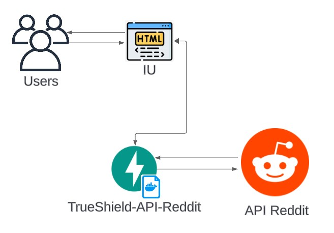

# API Reddit

## Introducción de la API

Esta API permite la gestión y consulta de posts de Reddit a través de diferentes palabras clave. La API está desarrollada con **FastAPI** y utiliza `PRAW` para la consulta de datos desde Reddit.

## Diagrama de arquitectura



## ¿Cómo está dividida la API?

### Estructura del proyecto

- `models/`
  - `models.py` - Archivo que contiene los modelos de la clase.
- `routes/`
  - `reddit.py` - Archivo que contiene las rutas de la API.
- `services/`
  - `reddit.py` - Archivo que contiene todas las funciones de lógica.
- `main.py` - Archivo principal de la API donde se incluyen las rutas.
- `requirements.txt` - Archivo con las librerías y paquetes necesarios.
- `.env` - Archivo que contiene las variables de entorno necesarias para la conexión con Reddit.

> [!TIP]
> Mantener una estructura modular del proyecto facilita el mantenimiento y la escalabilidad del mismo.

### Componentes

`main.py`: Contiene la configuración principal de **FastAPI** y la inclusión de las rutas desde el módulo `routes`.

`models/models.py`: Definición del modelo de datos utilizando **Pydantic**.

`routes/reddit.py`: Definición de la ruta de la API.

**Rutas:**
- `/contrasting`: Realiza una búsqueda de posts en Reddit basada en un conjunto de palabras clave y devuelve los más relevantes.

`services/reddit.py`: Contiene la lógica para la consulta de posts en Reddit y el procesamiento de los resultados.

## Ejecutemos la API

### Iniciamos un entorno virtual (Opcional)

> [!TIP]
> Usar un entorno virtual evita conflictos entre las dependencias de distintos proyectos.

- Abre una terminal y navega al directorio del proyecto.
- Crea el entorno:

```
python -m venv venv 
```

- Activa el entorno creado (Para Windows):

```
.\venv\Scripts\activate
```

### Instalamos los requerimientos

-   Cuando tengas el entorno virtual activado, puedes instalar las dependencias necesarias:

```
pip install -r requirements.txt
```

### Clonar y ejecutar

- Clonamos el repo:

```
git clone https://github.com/Lagares02/TrueShield-API-Reddit.git
cd TrueShield-API-Reddit
```

> [!IMPORTANT]
> No olvides configurar tus variables de entorno en el archivo `.env` para una correcta ejecución de la API.

- **Crear un proyecto en Reddit**: Para obtener las credenciales necesarias (`CLIENT_ID`, `CLIENT_SECRET`, `UG`), necesitas crear un proyecto en Reddit. Puedes hacerlo siguiendo estos pasos:
  - Ve a [Reddit App Preferences](https://www.reddit.com/prefs/apps).
  - Inicia sesión con tu cuenta de Reddit.
  - Desplázate hacia abajo y haz clic en "Create App" o "Create Another App".
  - Completa el formulario para crear una nueva aplicación. Puedes usar cualquier nombre y descripción, pero asegúrate de que el tipo de aplicación sea "script".
  - Añade la ruta de retorno que en este caso puedes usar `http://localhost:8003`
  - Después de crear la aplicación, obtendrás el `client_id`, `client_secret`, y para el `user_agent` es "MyRedditApp/0.1 by YourRedditUsername".

- Configura tus variables de entorno en el archivo `.env`:

```
CLIENT_ID = tu_client_id
CLIENT_SECRET = tu_client_secret
UG = tu_user_agent
```

- Iniciamos el servidor con tan solo:

```
py main.py
```

> [!WARNING]
> Asegúrate de que el puerto `8003` esté libre para evitar conflictos con otras aplicaciones.

- Abre tu navegador y navega a `http://127.0.0.1:8003` para ver la interfaz de usuario.